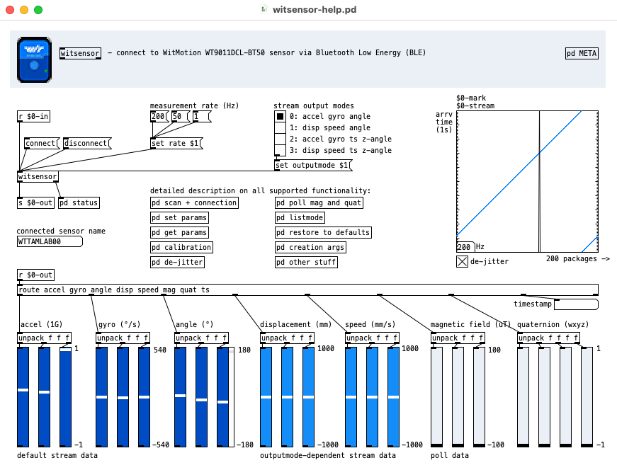

## [witsensor] Pure-Data External

for WitMotion WT9011DCL-BT50 sensor



### Build

```bash
git clone --recurse-submodules https://github.com/ben-wes/pd-witsensor.git
cd pd-witsensor
make deps && make
```

### Usage (Pd)

```
[witsensor]
[witmotion]
```

**witsensor** – BLE client for WitMotion sensor (accel, gyro, etc.). Open help patch for extensive documentation.

**witmotion** – IMU motion processor: inlet `[ax ay az gx gy gz]` or accel/gyro (3 floats each). Mag via separate `mag` message (slower rate OK). Outputs quat, accdyn, speed. Madgwick AHRS (IMU + optional mag).

### License

- **This project**: Unlicense (public domain). Free for any use. See `LICENSE`.
- **SimpleBLE**: Business Source License 1.1 (BUSL‑1.1). Non‑commercial use permitted; commercial use requires a SimpleBLE commercial license. Each version converts to GPL‑3 after four years. See `SimpleBLE/LICENSE.md`.
- **WIT sensors**: This project uses the sensor's communication protocol (not proprietary SDK code).
